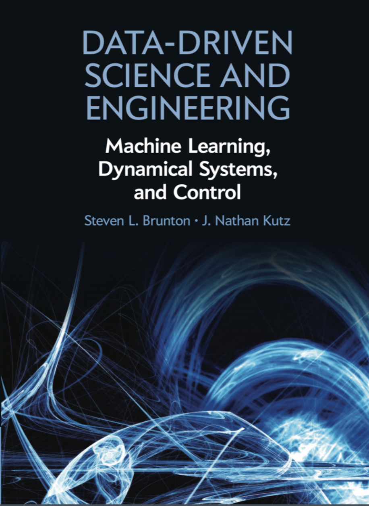
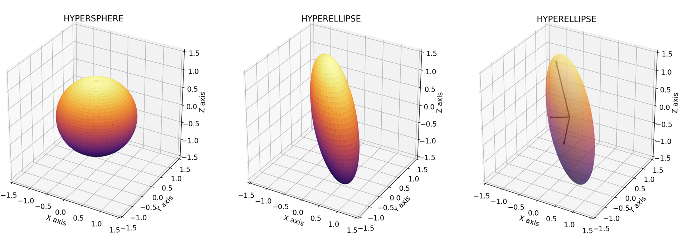

# MODELLING FROM MEASUREMENTS 

This repo contains notes and homeworks of the course "Modeling from Measurements" 2019/2020 held at the Politecnico di Milano by Professor [J. Nathan Kutz](https://amath.washington.edu/people/j-nathan-kutz). The reference book is ["Machine Learning, Dynamical Systems and Control"](http://www.databookuw.com) by Steven L. Brunton & J. Nathan Kutz.

# Table of Contents
- [Lectures](Lectures/)
 1. [SIngular Values Decomposition](Lectures/Lecture01.pdf)
    * Principal Components
    * Coordinates Discovery
 3. [Data Driven Dynamical Systems](Lectures/Lecture03.pdf)
    * Dynamic Mode Decompositition (DMD)
    * Koopman Operator
    * Time Delay Embeddings
 4. [Regression and Model Selection](Lectures/Lecture04.pdf)
    * Model Discovery
 5. [Data Assimilation](Lectures/Lecture05.pdf)
    * Kalman Filters
 6. [Artificial Neural Networks](Lectures/Lecture06.pdf)
    * Backpropagation
    * Gradient Descent
 7. [Artificial Neural Networks](Lectures/Lecture07.pdf)
    * CNN
 8. [Sensors](Lectures/Lecture08.pdf)
    * Compressed Sensing
    * Gappy POD

- [Notebooks](notebooks/)
 1. [Notebook 1](notebooks/Notebook01.ipynb)
  

    Figure: Principal components of a linear transformation matrix

3. [Notebook 3](notebooks/Notebook03.ipynb)

    Figure: Nonlinear Schrödinger (NLS) equation

4. [Notebook 4](notebooks/Notebook04.ipynb)
5. [Notebook 5](notebooks/Notebook05.ipynb)

    Figure: Lorenz equations

6. [Notebook 6](notebooks/Notebook06.ipynb)

    Figure: Stochastic gradient descent

7. [Notebook 7](notebooks/Notebook07.ipynb)

- [Papers](papers/)